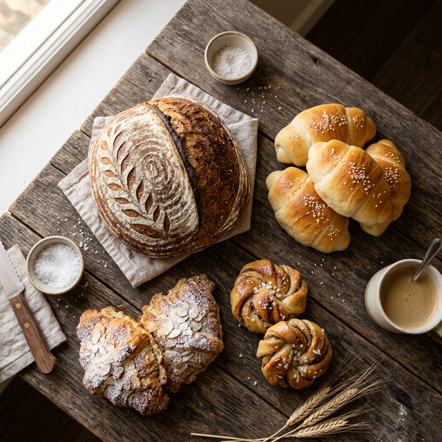

# Kirana Cake by Mimi 🍰

Kirana Cake by Mimi adalah platform e-commerce katalog untuk toko roti rumahan yang berspesialisasi dalam **Sourdough Breads** dan **Traditional Indonesian Snacks**. Platform ini dirancang dengan estetika premium, performa tinggi, dan integrasi langsung ke saluran penjualan (Tokopedia & WhatsApp).



## ✨ Fitur Unggulan

- **Katalog Produk Dinamis**: Tampilan grid produk yang cantik dengan dukungan kategori (Sourdough, Snack, Pastry).
- **Detail Modal & Carousel**: Lihat detail produk secara mendalam dengan foto galeri dalam format carousel.
- **Dual CTA Buttons**:
  - **Tokopedia**: Link langsung ke halaman produk di marketplace.
  - **WhatsApp Order**: Pesan otomatis yang menyertakan nama produk yang ingin dibeli.
- **Desain Responsif & Dark Mode**: Tampilan yang dioptimalkan untuk perangkat mobile dan desktop dengan dukungan mode gelap otomatis.
- **Performa Tinggi**: Menggunakan Next.js App Router dan optimasi gambar untuk pemuatan halaman yang instan.
- **Docker Ready**: Siap dideploy menggunakan Docker dan Docker Compose.

## 🚀 Teknologi

- **Framework**: [Next.js 14](https://nextjs.org/) (App Router)
- **Styling**: [Tailwind CSS](https://tailwindcss.com/)
- **Bahasa**: [TypeScript](https://www.typescriptlang.org/)
- **Data**: Local JSON Storage (mudah dikelola tanpa database berat)
- **Deployment**: [Docker](https://www.docker.com/) & [Docker Compose](https://docs.docker.com/compose/)

## 🛠️ Persiapan & Instalasi

### Menjalankan Secara Lokal

1. **Clone repository**:
   ```bash
   git clone https://github.com/alfin-nandha/kirana-cake.git
   cd kirana-cake
   ```

2. **Instal dependensi**:
   ```bash
   npm install
   ```

3. **Jalankan server pengembangan**:
   ```bash
   npm run dev
   ```
   Buka [http://localhost:3000](http://localhost:3000) di browser Anda.

### Menggunakan Docker

Anda dapat menjalankan aplikasi ini secara instan menggunakan Docker Compose tanpa perlu menginstal Node.js secara lokal:

```bash
docker-compose up -d --build
```
Aplikasi akan tersedia di [http://localhost:3000](http://localhost:3000).

## 📁 Struktur Proyek

- `src/app`: Routing dan logic halaman utama.
- `src/components`: Komponen UI yang dapat digunakan kembali (ProductCard, Modal, Section, dll).
- `src/data`: File JSON yang berisi data produk, review, dan informasi toko.
- `public/products`: Direktori penyimpanan foto produk.
- `Dockerfile` & `docker-compose.yml`: Konfigurasi containerisasi.

---
Dibuat dengan ❤️ untuk Kirana Cake by Mimi.
